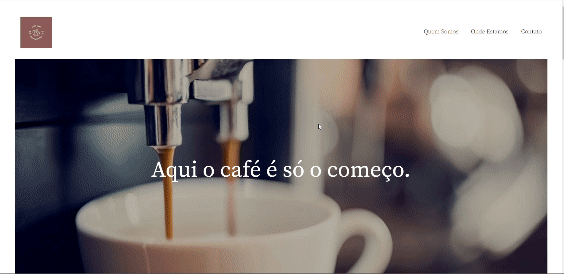

<h1 align="center"> Landing Code Café </h1>

  <a href="#-tecnologias">Tecnologias</a>&nbsp;&nbsp;&nbsp;|&nbsp;&nbsp;&nbsp;
  <a href="#-projeto">Projeto</a>&nbsp;&nbsp;&nbsp;|&nbsp;&nbsp;&nbsp;
  <a href="#-layout">Layout</a>&nbsp;&nbsp;&nbsp;|&nbsp;&nbsp;&nbsp;
  <a href="#memo-licença">Licença</a>

  

 

  

## 🚀 Tecnologias

Esse projeto foi desenvolvido com as seguintes tecnologias:

- HTML e CSS
- Git e Github
- Figma

## 💻 Projeto

A Landing Code Café é uma pagina de uma cafeteria.

- [Acesse o projeto finalizado, online](https://danyeloli.github.io/landing-page-code-cafe/)

## :memo: Licença

Esse projeto está sob a licença MIT.

---

Feito com ♥ by Daniel Oliveira
